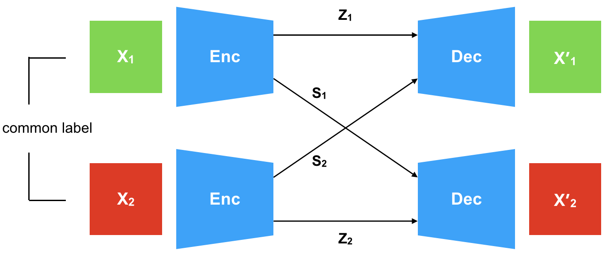
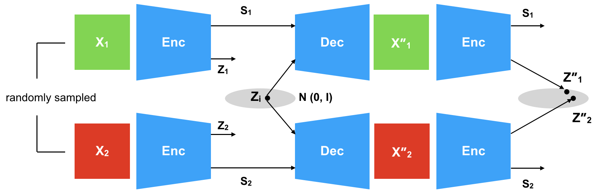

##### Download

+ [Paper](cycle-vae.pdf)
+ [Code and data](github.com/ananyahjha93/cycle-consistent-vae)

---

##### Abstract

Generative models that learn disentangled representations for different factors of variation in an image can be very useful for targeted data augmentation. By sampling from the disentangled latent subspace of interest, we can efficiently generate new data necessary for a particular task. Learning disentangled representations is a challenging problem, especially when certain factors of variation are difficult to label. In this paper, we introduce a novel architecture that disentangles the latent space into two complementary subspaces by using only weak supervision in form of pairwise similarity labels. Inspired by the recent success of cycle-consistent adversarial architectures, we use cycle-consistency in a variational auto-encoder framework. Our non-adversarial approach is in contrast with the recent works that combine adversarial training with auto-encoders to disentangle representations. We show compelling results of disentangled latent subspaces on three datasets and compare with recent works that leverage adversarial training.


---

##### Figure 3: Forward cycle




##### Figure 4: Reverse Cycle



---

##### Citation

Ananya Harsh Jha, Saket Anand, Maneesh Singh, VSR Veeravasarapu; Proceedings of the European Conference on Computer Vision (ECCV), 2018, pp. 805-820. 
https://doi.org/10.48550/arXiv.1804.10469.

```BibTeX
@InProceedings{Jha_2018_ECCV,
author = {Jha, Ananya Harsh and Anand, Saket and Singh, Maneesh and Veeravasarapu, VSR},
title = {Disentangling Factors of Variation with Cycle-Consistent Variational Auto-Encoders},
booktitle = {Proceedings of the European Conference on Computer Vision (ECCV)},
month = {September},
year = {2018}
}
```

<!-- --- -->

<!-- ##### Related material

+ [Presentation slides](presentation1.pdf)
+ [Dissertation title](https://escholarship.org/uc/item/7jr3m96r) – PhD dissertation on which this paper is based.
+ [Column title](https://cep.lse.ac.uk/pubs/download/cp365.pdf) – Nontechnical column describing the paper. -->

