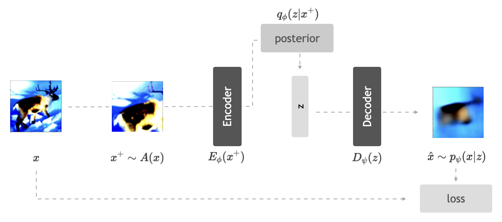

##### Download

+ [Paper](aavae.pdf)
+ [Code and data](https://github.com/ananyahjha93/stochastic-autoencoders)

---

##### Abstract

Recent methods for self-supervised learning can be grouped into two paradigms: contrastive and non-contrastive approaches. Their success can largely be attributed to data augmentation pipelines which generate multiple views of a single input that preserve the underlying semantics. In this work, we introduce augmentation-augmented stochastic autoencoders (AASAE), yet another alternative to self-supervised learning, based on autoencoding. We derive AASAE starting from the conventional variational autoencoder (VAE), by replacing the KL divergence regularization, which is agnostic to the input domain, with data augmentations that explicitly encourage the internal representations to encode domain-specific invariances and equivariances. We empirically evaluate the proposed AASAE on image classification, similar to how recent contrastive and non-contrastive learning algorithms have been evaluated. Our experiments confirm the effectiveness of data augmentation as a replacement for KL divergence regularization. The AASAE outperforms the VAE by 30\% on CIFAR-10, 40\% on STL-10 and 45\% on Imagenet. On CIFAR-10 and STL-10, the results for AASAE are largely comparable to the state-of-the-art algorithms for self-supervised learning.

---

##### Figure 1: Augmentation-augmented stochastic autoencoder



---

##### Citation

```BibTeX
@inproceedings{Falcon2021AASAEAS,
  title={AASAE: Augmentation-Augmented Stochastic Autoencoders},
  author={William Falcon and A. Jha and Teddy Koker and Kyunghyun Cho},
  year={2021},
  url={https://api.semanticscholar.org/CorpusID:246634445}
}
```

<!-- ---

##### Related material

+ [Presentation slides](presentation2.pdf) -->

